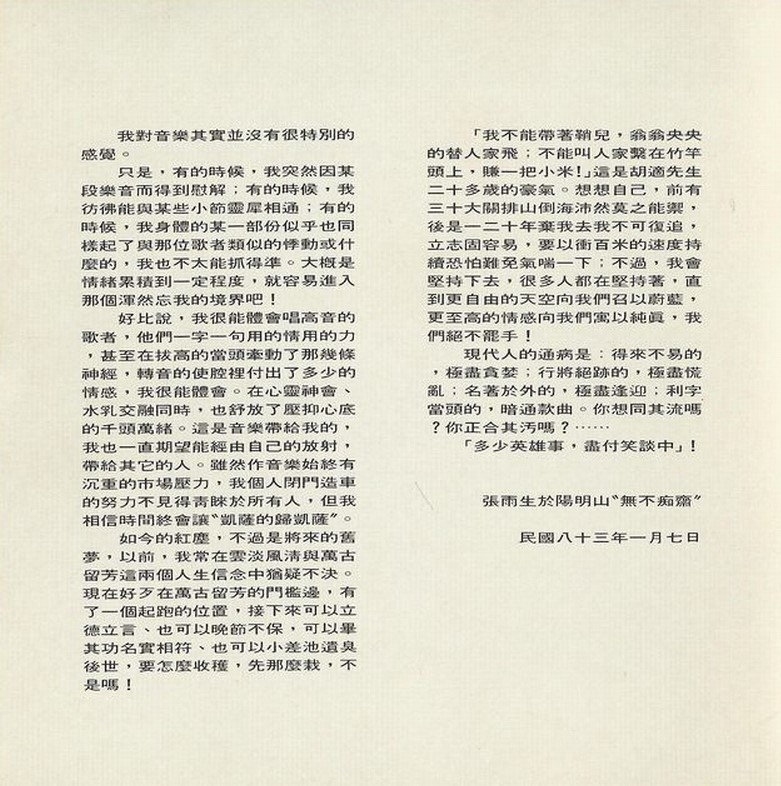

reference

# 专辑

## 6 个朋友

### 参考

-   [Apple Music](https://music.apple.com/cn/album/%E6%88%91%E7%9A%84%E6%9C%AA%E6%9D%A5%E4%B8%8D%E6%98%AF%E6%A2%A6/1444992243?i=1444992246)
-   [pixnet](https://hom11007.pixnet.net/blog/post/28106631)
-   [想念雨生](https://www.tomchang.cn/music/collection/20.html)

### 已解决

专辑名称：[Apple Music](https://music.apple.com/cn/album/%E6%88%91%E7%9A%84%E6%9C%AA%E6%9D%A5%E4%B8%8D%E6%98%AF%E6%A2%A6/1444992243?i=1444992246) 记为“六个朋友”，[pixnet](https://hom11007.pixnet.net/blog/post/28106631) 里给出了专辑图片，是“6 个朋友”。

### 存在冲突

发行时间冲突：[Apple Music](https://music.apple.com/cn/album/%E6%88%91%E7%9A%84%E6%9C%AA%E6%9D%A5%E4%B8%8D%E6%98%AF%E6%A2%A6/1444992243?i=1444992246) 记录为 1988 年 5 月 1 日，[想念雨生](https://www.tomchang.cn/music/collection/20.html) 记录为 1988 年 5 月 26 日。

## 天天想你

### 参考

-   [「天天想你」製作感言 - yu-sheng.org](https://web.archive.org/web/20050217133312/http://yu-sheng.org/Literature/showlit.php?type=3&rank=2)
-   [天天想你 - tomchang.cn](https://www.tomchang.cn/music/album/10.html)

### 存在冲突

文字内容冲突：[「天天想你」製作感言 - yu-sheng.org](https://web.archive.org/web/20050217133312/http://yu-sheng.org/Literature/showlit.php?type=3&rank=2) 作“溺斃”，[天天想你 - tomchang.cn](https://www.tomchang.cn/music/album/10.html) 作“溺死”

文字内容冲突：[「天天想你」製作感言 - yu-sheng.org](https://web.archive.org/web/20050217133312/http://yu-sheng.org/Literature/showlit.php?type=3&rank=2) 作“不要等到一切都太遲”，[天天想你 - tomchang.cn](https://www.tomchang.cn/music/album/10.html) 作“不要等到一切都已太迟”。

文字内容冲突：[「天天想你」製作感言 - yu-sheng.org](https://web.archive.org/web/20050217133312/http://yu-sheng.org/Literature/showlit.php?type=3&rank=2) 文末致谢换行，[天天想你 - tomchang.cn](https://www.tomchang.cn/music/album/10.html)文末致谢没有换行。

### 缺少来源

发行时间缺少

## 想念我

### 参考

-   [想念我 - tomchang.cn](https://www.tomchang.cn/music/album/11.html)
-   [「想念我」製作感言 - yu-sheng.org](https://web.archive.org/web/20060116140735/http://www.yu-sheng.org/Literature/showlit.php?type=3&rank=3)

### 存在冲突

文字内容冲突：专辑制作感言中，[「想念我」製作感言 - yu-sheng.org](https://web.archive.org/web/20060116140735/http://www.yu-sheng.org/Literature/showlit.php?type=3&rank=3) 作“會隨著光陰而無法辨識”，[想念我 - tomchang.cn](https://www.tomchang.cn/music/album/11.html) 作“会随着光阴而变得无法辨识”。后者多了“变得”两个字。

文字内容冲突：《就为你》文案中，[「想念我」製作感言 - yu-sheng.org](https://web.archive.org/web/20060116140735/http://www.yu-sheng.org/Literature/showlit.php?type=3&rank=3) 作“曲子該是進大學前就完成的”，[想念我 - tomchang.cn](https://www.tomchang.cn/music/album/11.html) 作“曲子是进大学前就完成的”。后者少了一个“该”字。

## 天空不要为我掉眼泪

### 参考

-   [你是我真心的執著 - yu-sheng.org](https://web.archive.org/web/20050217035140/http://yu-sheng.org/Music/song.php?a=25&s=2)
-   [天空不要为我掉眼泪 - wikipedia](https://zh.wikipedia.org/zh-sg/%E5%A4%A9%E7%A9%BA%E4%B8%8D%E8%A6%81%E7%82%BA%E6%88%91%E6%8E%89%E7%9C%BC%E6%B7%9A)
-   [天空不要为我掉眼泪 - tomchang.cn](https://www.tomchang.cn/music/collection/23.html)

### 存在冲突

[天空不要为我掉眼泪 - wikipedia](https://zh.wikipedia.org/zh-sg/%E5%A4%A9%E7%A9%BA%E4%B8%8D%E8%A6%81%E7%82%BA%E6%88%91%E6%8E%89%E7%9C%BC%E6%B7%9A) 记载发行时间为 1990 年 11 月 23 日，[天空不要为我掉眼泪 - tomchang.cn](https://www.tomchang.cn/music/collection/23.html) 记载为 1989 年 10 月 26 日。

## 青春像把枪

### 参考

[青春像把枪 - tomchang.cn](https://www.tomchang.cn/music/collection/24.html)

### 缺少来源

发行时间缺少

## 张雨生创作专辑

### 参考

-   [张雨生创作专辑 - tomchang.cn](https://www.tomchang.cn/music/album/12.html)
-   [「帶我去月球」製作感言 - yu-sheng.org](https://web.archive.org/web/20071220192022/http://yu-sheng.org/Literature/showlit.php?type=3&rank=4)

### 存在冲突

文字冲突：[张雨生创作专辑 - tomchang.cn](https://www.tomchang.cn/music/album/12.html) 的制作感言和 [「帶我去月球」製作感言 - yu-sheng.org](https://web.archive.org/web/20071220192022/http://yu-sheng.org/Literature/showlit.php?type=3&rank=4) 存在冲突，使用文字对比软件可以分析，以后者为准。

## 大海

### 参考

-   [大海 - tomchang.cn](https://www.tomchang.cn/music/album/13.html)
-   [大海 - yu-sheng.org](https://web.archive.org/web/20050215193157/http://yu-sheng.org/Music/album.php?action=sa&id=4)

### 存在冲突

发行时间冲突：[大海 - tomchang.cn](https://www.tomchang.cn/music/album/13.html) 记载发行时间为 1992 年 11 月 30 日，[大海 - yu-sheng.org](https://web.archive.org/web/20050215193157/http://yu-sheng.org/Music/album.php?action=sa&id=4) 记载发行时间为 1992 年 12 月。

## 一天到晚游泳的鱼

### 参考

-   [一天到晚游泳的鱼 - tomchang.cn](https://www.tomchang.cn/music/album/14.html)
-   [一天到晚游泳的鱼 - yu-sheng.org](https://web.archive.org/web/20120824043855/http://www.yu-sheng.org/Music/album.php?action=sa&id=5)

### 存在冲突

发行时间冲突：[一天到晚游泳的鱼 - tomchang.cn](https://www.tomchang.cn/music/album/14.html) 记载为 1993 年 8 月 24 日，[一天到晚游泳的鱼 - yu-sheng.org](https://web.archive.org/web/20120824043855/http://www.yu-sheng.org/Music/album.php?action=sa&id=5) 记载为 1993 年 6 月。

## 自由歌

### 参考

-   [自由歌唱片 - carousell](https://www.carousell.com.hk/p/1092479588/)
-   [自由歌 - tomchang.cn](https://www.tomchang.cn/music/compilation/28.html)
-   [自由歌 - yu-sheng.org](https://web.archive.org/web/20050215193801/http://yu-sheng.org/Music/album.php?action=sa&id=19)

### 来源

 来自 [自由歌唱片 - carousell](https://www.carousell.com.hk/p/1092479588/)

## 卡拉 OK·台北·我

### 参考

-   [卡拉 OK‧台北‧我 - yu-sheng.org](https://web.archive.org/web/20050215193844/http://yu-sheng.org/Music/album.php?action=sa&id=6)
-   [卡拉 Ok .台北 . 我 - tomchang.cn](https://www.tomchang.cn/music/album/15.html)
-   [动物的悲歌 - music.163.com](https://music.163.com/#/song?id=187861)

### 存在冲突

发行时间冲突：[卡拉 OK‧台北‧我 - yu-sheng.org](https://web.archive.org/web/20050215193844/http://yu-sheng.org/Music/album.php?action=sa&id=6) 记录发行时间为 1994 年 8 月，[卡拉 Ok .台北 . 我 - tomchang.cn](https://www.tomchang.cn/music/album/15.html) 记录发行时间为 1994 年 9 月。

## 还是朋友

### 参考

-   [还是朋友 - tomchang.cn](https://www.tomchang.cn/music/album/16.html)
-   [還是朋友 - yu-sheng.org](https://web.archive.org/web/20050215194329/http://yu-sheng.org/Music/album.php?action=sa&id=7)

## 白色才情

### 参考

-   [[文案]《两伊战争 - 白色才情》- douban.com](https://site.douban.com/widget/notes/96866/note/93538457/)
-   [白色才情 - tomchang.cn](https://www.tomchang.cn/music/album/17.html)
-   [《兩伊戰爭–白色才情》 - forward-music.blog](https://forward-music.blog/%e5%bc%b5%e9%9b%a8%e7%94%9f%e3%80%8a%e5%85%a9%e4%bc%8a%e6%88%b0%e7%88%ad-%e7%99%bd%e8%89%b2%e6%89%8d%e6%83%85%e3%80%8b%e5%b0%88%e8%bc%af/)

### 存在冲突

文案感言冲突：[[文案]《两伊战争 - 白色才情》- douban.com](https://site.douban.com/widget/notes/96866/note/93538457/) 将文案和感言混在一起，[白色才情 - tomchang.cn](https://www.tomchang.cn/music/album/17.html) 分开了文案、致谢和感言。

文案冲突：沉默之沙文案冲突，[[文案]《两伊战争 - 白色才情》- douban.com](https://site.douban.com/widget/notes/96866/note/93538457/) 作“试想”，[白色才情 - tomchang.cn](https://www.tomchang.cn/music/album/17.html) 作“是想”。

发行时间冲突：[白色才情 - tomchang.cn](https://www.tomchang.cn/music/album/17.html) 记为 7 月 14 日，[《兩伊戰爭–白色才情》 - forward-music.blog](https://forward-music.blog/%e5%bc%b5%e9%9b%a8%e7%94%9f%e3%80%8a%e5%85%a9%e4%bc%8a%e6%88%b0%e7%88%ad-%e7%99%bd%e8%89%b2%e6%89%8d%e6%83%85%e3%80%8b%e5%b0%88%e8%bc%af/) 记为 7 月 1 日。

## 口试心非

### 参考

-   [《口是心非》照片 - tieba.baidu.com](https://tieba.baidu.com/p/775929583)
-   [发行日期 - forward-music.blog](https://forward-music.blog/%e5%bc%b5%e9%9b%a8%e7%94%9f_%e5%8f%a3%e6%98%af%e5%bf%83%e9%9d%9e/)

# 文章

# 信札
