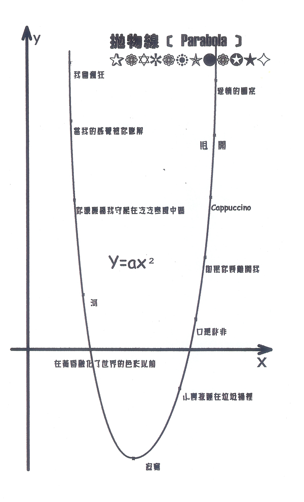

雨生为新专辑『口是心非』写给唱片公司的一封信[^1]

彭先生、陈老师、小彭、李桑以及亲爱的企宣兄弟姐妹们：

先祝各位 新年快乐！也愿丰华唱片能在诸位齐心协力的带领下，『气冲斗牛之墟』，『丰』收之歌、耀眼若日月光『华』！

是的，张雨生的作品又来了。

忘记过去，放眼将来，是实现商场成功的铁则。我们必须忘记过去成王败寇盖棺论定的结果，才能以全新的姿态放眼无线成王败寇可能的将来。所以，这一次我得准备，与其说很成熟，不如说很充分；与其说很啰嗦，不如说很诚恳；与其说很花俏，不如说很讲究；与其说很滥情，不如说很感性。

这一次我准备的很充分：十二首歌，十二段导引文字，加上前言后记林林总总五千多字，并一幅抛物线图，手笔之大，流行歌坛罕见。这一次我准备的很讲究：我几乎透过所有的文字形态展现文字，韵文、散文、杂记、小说、寓言神话、语录体、对话体等等，用功之深，流行歌坛罕见。

这一次我准备的很感性：我像摊开手掌，暴露我的感情纹线，放弃所有的奇字怪句，舒词缓语直指心性，淬炼之精，突破我自己有史以来的格局，亦流行歌坛罕见。

我们都知道，情歌并不难写，难在激情的稍纵即逝，真正的欢愉总是乍现灵光，一旦冷眼旁观，便失去了感人的兴味。我想，我讨厌不痛不痒、却又苦得稀里哗啦的那种情歌，尤其被女歌者诠释出来，让我想起了西蒙波娃的话，『在性方面，女人活在男人粗糙的世界之中』，为了补偿自己，她们会特别爱好『精美的东西』。

好吧！一切皇天在上，诸位自有公论，废话就此打住。

如果这些未能尽符诸位心中期许，请大刺刺将冷水泼回，我必悉心受教。我与诸位合作也将近十年，穷尽感激的言语，也数不尽我心中如丝如缕的谢意呀！

张小宝雨生

丁丑年 1997 于淡水沙崙 悠然娱海小楼

[^1]: https://www.tomchang.cn/archive/letter/72.html